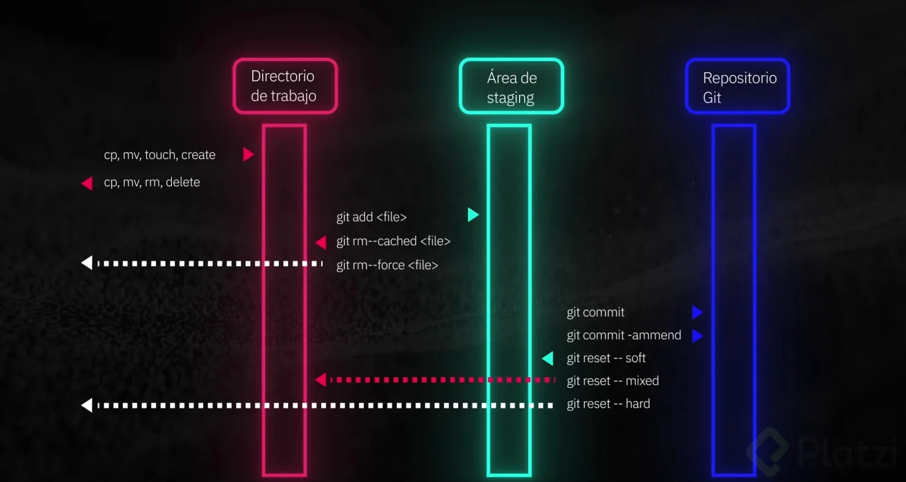

- [Control de Versiones con Git y GitHub: De Básico a Avanzado](https://platzi.com/cursos/gitgithub/que-son-git-y-github/)

- [Control de Versiones con Git: Comandos Básicos y Flujo de Trabajo](https://platzi.com/cursos/gitgithub/comandos-basicos-de-git-add-commit-log/)

- [Gestión de ramas en Git: creación, fusión y eliminación eficiente](https://platzi.com/cursos/gitgithub/ramas-y-fusion-de-cambios-branch-merge-checkout/)
    git branch
    git branch test
    git checkout test
    git switch main
    git merge test
    git branch -D test

- [Git Reset vs Git Revert: Manejo de Historial y Corrección de Errores](https://platzi.com/cursos/gitgithub/volviendo-en-el-tiempo-en-git-reset-revert/)
    git reset --soft HEAD~1
    git reset --mixed HEAD~1
    git reset --hard HEAD~1
    git revert HEAD

- [Uso de Git Tag y Git Checkout para Gestión de Versiones y Revisión](https://platzi.com/cursos/gitgithub/gestion-de-versiones-con-tag-y-checkout/)
    - crear tag local
    git tag -a v1.0.0 -m "version 1.0.0"
    - listar tags
    git tag
    - mostrar tag
    git show v1.0.0
    - borrar tag local
    git tag -d v1.0.0
    - checkout a un commit
    git checkout 5c0e62ec0941286d223f7b998533a73f411608a5

- [Resolución de Conflictos de Ramas en Git paso a paso](https://platzi.com/cursos/gitgithub/resolucion-de-conflictos-en-git/)
    - resolver conflictos
    crear archivo `conflicto.txt`